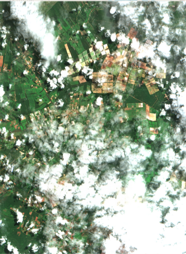
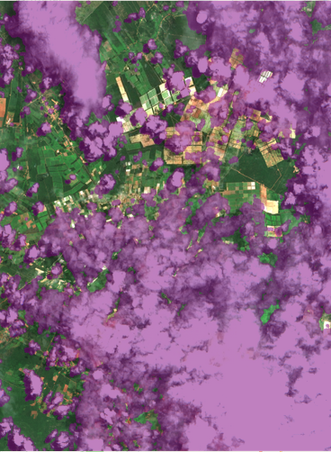
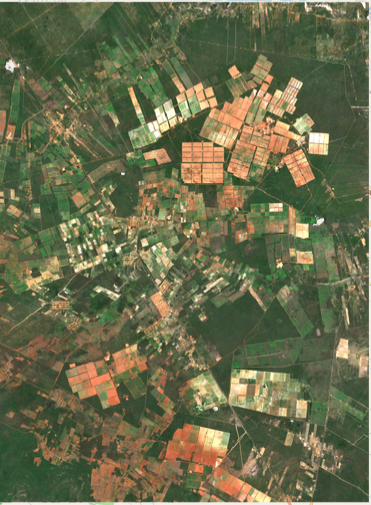

# Cloud Mask Comparison ☁️

     
     
    

## Overview
This repository contains the code and data for comparing different cloud masking techniques used in satellite imagery processing. Cloud masks are essential for removing clouds from satellite images to ensure accurate analysis of the underlying surface features.

## Sentinel-2 Masks compared
|Pub|Year|Title|Code|TYPE|TECH
|:---:|:---:|:---:|:---:|:---:|:---:|
|-|-|[s2cloudless](https://developers.google.com/earth-engine/tutorials/community/sentinel-2-s2cloudless)|[Code](https://developers.google.com/earth-engine/tutorials/community/sentinel-2-s2cloudless)|CNN|GEE|
|-|-|[S2 SCORE+](https://developers.google.com/earth-engine/datasets/catalog/GOOGLE_CLOUD_SCORE_PLUS_V1_S2_HARMONIZED)|[Code](https://developers.google.com/earth-engine/datasets/catalog/GOOGLE_CLOUD_SCORE_PLUS_V1_S2_HARMONIZED)|CNN|GEE|
|-|-|[Fmask](https://www.sciencedirect.com/science/article/pii/S0034425719302172)|[Code](https://github.com/ubarsc/python-fmask)|physical-rule-based|MATLAB|
|-|-|[sen2cor](https://step.esa.int/main/snap-supported-plugins/sen2cor/)|[Code](hhttps://github.com/c-core-labs/sen2cor)|physical-rule-based|C++|
|-|-|[Satellite-cloud-removal-dip]()|[Code](https://github.com/strath-ai/satellite-cloud-removal-dip)|CNN|PYTORCH|
|-|-|[SEnSeIv2](https://ieeexplore.ieee.org/document/10505181)|[Code](https://github.com/aliFrancis/SEnSeIv2)|CNN|PYTORCH|
|-|-|[dsen2-cr](https://www.sciencedirect.com/science/article/pii/S0924271620301398?via%3Dihub)|[Code](https://github.com/ameraner/dsen2-cr)|CNN|TENSORFLOW|
|-|-|[kappamask]()|[Code]()|CNN|TENSORFLOW|